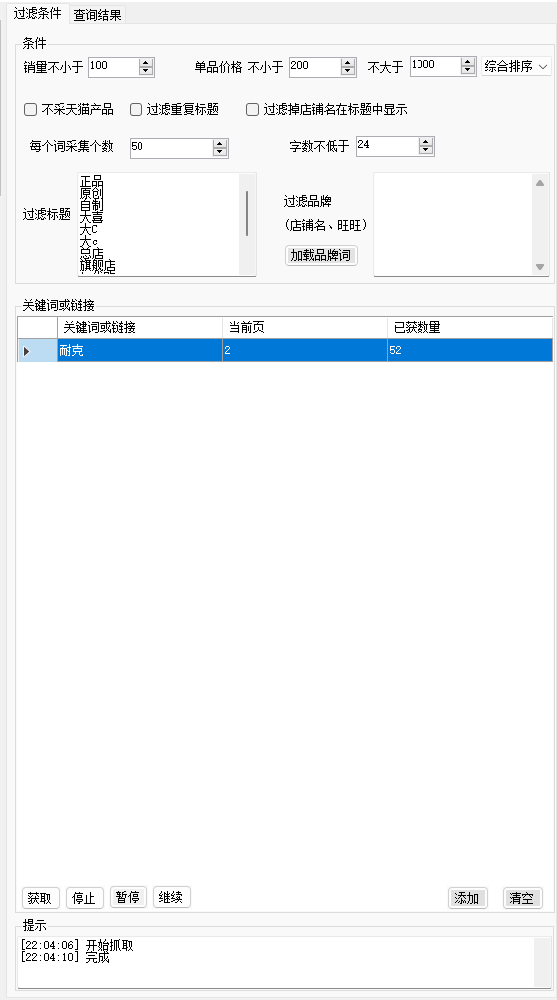
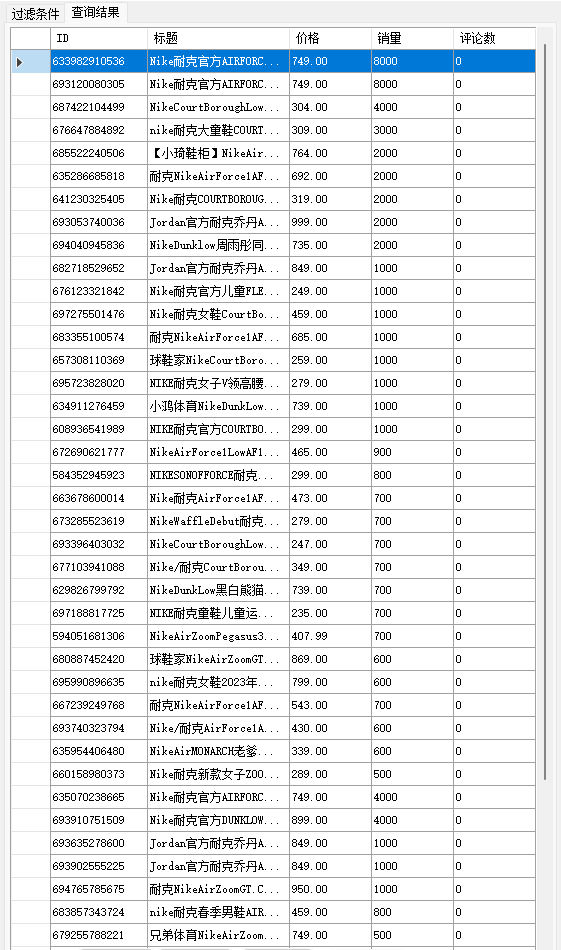
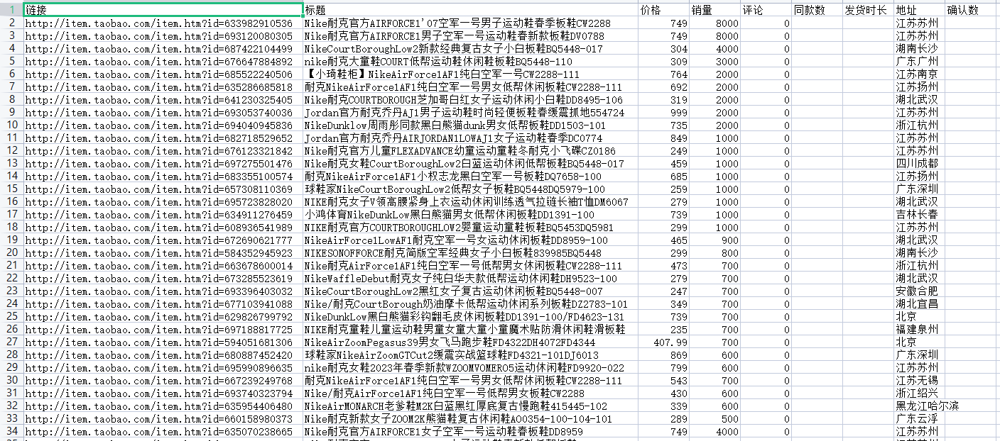

# TaobaoSpider

淘宝数据爬取一直是一个不疼但很痒的问题。
淘宝有网页版，并不像闲鱼、得物之类的只有App端数据呈现。
但淘宝又有厉害到不行的风控和反爬算法，总之想拿淘宝数据，想想很容易，做做又很不现实。

 

最近研究学习了一款类似的软件，终于可以拿到淘宝数据了。

总之效率不高，自己用用可以，肯定不会疯狂到去大量爬取淘宝数据，毕竟也没什么用，还影响到淘宝运营就不好了。

以学习为目的，以解放自己双手为方向，这也是软件作者的初衷了吧。

